# Project UML Diagram — Exhaustive System Architecture

This diagram visualizes the complete project architecture, including all layers: Models, Services, Controllers, Utilities, and Exception Handling.

```mermaid
classDiagram
    %% Entry Point
    class StudentManagementApplication {
        +main(args: String[]) void
    }

    %% Model Layer
    class BaseEntity {
        <<abstract>>
        -int id
        -LocalDateTime createdAt
        -LocalDateTime updatedAt
        +getSummary() String
        +touch() void
    }

    class Student {
        -String studentId
        -String firstName
        -String lastName
        -String email
        -double gpa
        -List~Double~ grades
        +getSummary() String
        +recalculateGpa() void
    }

    class GraduateStudent {
        -String researchTopic
        -String supervisorName
        +getSummary() String
    }

    class Course {
        -String courseId
        -String courseName
        -int credits
        +getSummary() String
    }

    class Enrollment {
        -int enrollmentId
        -int studentDbId
        -int courseDbId
        -double grade
        +getSummary() String
    }

    %% Service Layer (Interfaces)
    class StudentService {
        <<interface>>
        +addStudent(Student) void
        +findStudentById(int) Student
        +sortByGpa() List~Student~
    }

    class CourseService {
        <<interface>>
        +addCourse(Course) void
        +getAllCourses() List~Course~
    }

    class EnrollmentService {
        <<interface>>
        +enrollStudent(int, int) void
        +assignGrade(int, double) void
        +deleteEnrollment(int) void
    }

    %% Service Layer (Implementations)
    class StudentServiceImpl {
        -List~Student~ students
        -AtomicInteger idCounter
        +findStudentByIdRecursive(int) Student
    }

    class CourseServiceImpl {
        -List~Course~ courses
    }

    class EnrollmentServiceImpl {
        -List~Enrollment~ enrollments
    }

    %% Controller Layer
    class StudentController {
        +getAllStudents() List
        +getStudentById(int) Student
    }

    class CourseController {
        +getAllCourses() List
        +addCourse(Course) Course
    }

    class EnrollmentController {
        +enroll(int, int) Enrollment
    }

    class AuthController {
        +login(LoginRequest) ResponseEntity
    }

    %% Utility Layer
    class FileManager {
        -String studentsFile
        -String coursesFile
        -String enrollmentsFile
        +saveStudents(List) void
        +loadAll() void
    }

    class ActivityLogger {
        +log(String action, String details) void
    }

    class AuthStore {
        -Map~String, String~ credentials
        +authenticate(String, String) boolean
    }

    %% Exception Layer
    class GlobalExceptionHandler {
        +handleNotFound(Exception) ResponseEntity
    }

    class StudentNotFoundException { }
    class CourseNotFoundException { }
    class InvalidGradeException { }

    %% Relationships - Inheritance
    BaseEntity <|-- Student
    BaseEntity <|-- Course
    BaseEntity <|-- Enrollment
    Student <|-- GraduateStudent
    
    %% Relationships - Implementation
    StudentService <|.. StudentServiceImpl
    CourseService <|.. CourseServiceImpl
    EnrollmentService <|.. EnrollmentServiceImpl
    
    %% Relationships - Usage & Association
    StudentController --> StudentService
    CourseController --> CourseService
    EnrollmentController --> EnrollmentService
    AuthController --> AuthStore
    
    StudentServiceImpl --> FileManager : uses
    StudentServiceImpl --> ActivityLogger : uses
    
    StudentManagementApplication ..> StudentService : entry
```

## Description from Diagram:
This comprehensive diagram covers the full stack of the Student Management System:
- **Models**: Unified under `BaseEntity` for persistence tracking.
- **Services**: Solid interface/implementation pattern using Spring `@Service`.
- **Controllers**: REST entry points for frontend interaction.
- **Persistence & Utils**: File-based I/O and activity logging.
- **Exclusives**: Recursion in `StudentServiceImpl` and Custom Exception Handling.
