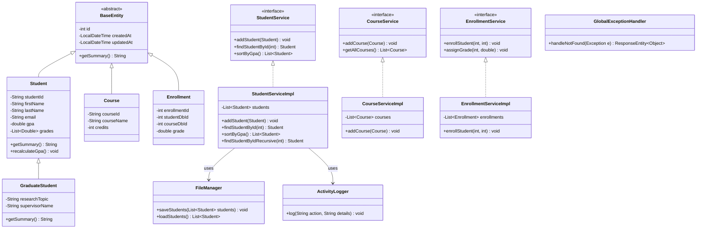

# Project UML Diagram

This diagram visualizes the core architecture, inheritance hierarchy, and relationships between classes.

## Description from Diagram:
This comprehensive diagram shows the inheritance hierarchy descending from `BaseEntity`, the implementation of multiple service interfaces, and the utility dependencies for persistence and logging.
